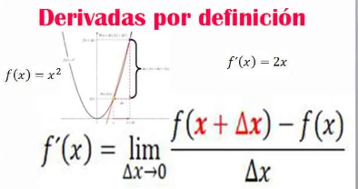

Felipe Cruz Pineda, Angie Vargas- M6A
# Clase Introductoria (Transformada de Laplace)
El presente resumen está dividido en dos partes, lo cual brinda un panorama general del curso de Dinámica de sistemas.

En primer lugar, se abordan conceptos básicos necesarios para el curso. Dando una explicación de conceptos que se utilizarán más adelante, lo cual nos da un parámetro general acerca de lo que tratará el curso.

Por otro lado, la segunda parte se centra en hacer un repaso de la transformada de Laplace, un tema clave para aplicar más adelante a los conceptos y temas que siguen en el curso.

##  1. Definiciones
>🔑 *Sistemas:* Un sistema es una combinación de componentes que actúan conjuntamente para alcanzar un objetivo específico. La combinación de componentes se puede representar por medio de reglas o principios que relacionan entradas con salidas.

    

 
Básicamente, se nos indica que un sistema es un conjunto de pautas y reglas que trabajan en sincronia para solventar un problema y llegar a un objetivo. Este cuenta con entradas que pasan por reglas que en este caso pueden ser modelos matemáticos hasta llegar a la salida, que básicamente sería el objetivo que se quiere.

>🔑*Sistema dinámico:* Un sistema se llama dinámico si su salida en el presente depende de una entrada en el pasado.
También, si su salida en curso depende solamente de la entrada en curso, el sistema se conoce como estático.

    

En este caso nos explica que un sistema es dinámico cuando la salida tiene dependencia de la entrada puesta anteriormente, dando así una especie de "ciclo", ya que siempre va a depender de los estados de entrada anteriores.

En este punto también nos explica que si esto no se cumple y la salida depende únicamente de la entrada propia del sistema, solo pasa a ser un sistema estático.

>🔑*Planta:* - Es todo lo físico que permite que se lleve a cabo un proceso. - Puede ser representado matemáticamente. - Puede ser representado a través de uno o varios sistemas.

Nos explica que la planta es básicamente todo lo físico y/o tangible que permite que todo el proceso se lleve a cabo.
Se suele confundir con proceso, pero sin embargo, al ver puntualmente su definición, ya se diferencia.

>🔑*Proceso:* Es la secuencia de pasos que permite el desarrollo o fabricación de un objeto o producto.
- A es el área de control que se usa como sinónimo de planta (aunque en sentido estricto no lo son).

Básicamente, el proceso es el paso a paso que se tiene en cuenta para resolver el problema o alcanzar el objetivo.

## 2. Modelos dinámicos:

En este apartado se nos explica que los modelos dinámicos son modelos matemáticos que relacionan las variables que se tengan con el tiempo y se necesita saber cuando cambian las variables de interés respecto al tiempo.  

$$f(t)$$

$$\frac{df(t)}{dt}$$

## 3. Derivada:
En este caso se nos presenta una breve descripción de la derivada como resumen de lo que ya se había visto en clases anteriores, presentada de la siguiente manera:

$$f(x)=x^2$$

$$\frac{\mathrm{df(x)} }{\mathrm{d} x}= 2x$$

💡**Ejemplo 1:**  $$\frac{\mathrm{df(2)} }{\mathrm{d} x}=2(2)= 4$$

💡**Ejemplo 2:**  $$\frac{\mathrm{df(3)} }{\mathrm{d} x}=2(3)= 6$$

💡**Ejemplo 3:**  $$\frac{\mathrm{df(0)} }{\mathrm{d} x}=2(0)= 0$$

    

## 4. Sistemas lineales y no lineales:

### 4.1. Sistemas lineales

>🔑 *Un sistema es lineal cuando cumple con el principio de superposición*

El principio de superposición consiste en la idea de que la respuesta completa es la suma de las respuestas individuales de cada sistema

>🔑 *Un sistema es lineal también cuando tiene una proporcionalidad entre la entrada y la salida. *

Esto quiere decir que la entrada tiene que ser directamente proporcional a la salida.

### 4.2. Sistemas no lineales

>🔑 *Un sistema no lineal cuando no cumple con el principio de superposición.*

es cuando no se cumple el primer púnto de los sistemas lineales. O sea la suma de las respuestas indiciduales no es el resultado final.

## 5. Modelamiento y Validacion:
En este caso es importante validar el modelo con respecto al sistema físico que se tiene para poder comparar la salida del modelo con la salida del físico; si no coinciden, se tiene que modificar el modelo hasta que coincidan sus salidas.

## Transformada de Laplace:

>🔑 *Es un cambio de espacio geométrico del dominio del tiempo hacia el dominio de la frecuencia compleja.
>- Ecuaciones con derivadas son transformadas inecuaciones algebraicas.
>- la transformada de Laplace muestra las exponenciales y sinusoidales presentes en una señal *.

Básicamente, la transformada de Laplace es un cambio de espacio geométrico del dominio del tiempo hacia el dominio de la frecuencia compleja; también estas son ecuaciones con derivadas que pasan a ser ecuaciones algebraicas y a esto se le conoce como transformada o transformar.

  
La forma de representarla es la siguiente: 

$$x(t)--->X(s)$$

y escribe de la siguiente manera:

$$L[f(t)]$$ 

## Transformada inversa:
En este punto nos explica el paso contrario de la transformada, que es la transformada inversa; sin embargo, en la siguiente clase se va a ver más a fondo.

se representa de la siguiente manera:

$$X(s)--->x(t)$$

y se escribe de la siguiente manera:

$$L^(-1) [f(t)]$$

## Tabla de transformadas:

A continuación se presentará una tabla de transformadas, la cual nos ayudará a resolver y a dar respuesta básicamente a los ejercicios planteados.

    

## Conclusiones:
Este resumen ofrece una visión general del contenido del curso, incluyendo conceptos previamente conocidos y otros menos familiares, pero fundamentales para el desarrollo de la carrera.

Además, el resumen destaca cómo se pueden aplicar estos conceptos dentro de la materia. En el contexto de la dinámica de sistemas, se abordan temas como la definición de sistemas, modelos matemáticos, la transformada (principal ecuación que será empleada en el curso), procesos, su alcance y la comprensión de lo que implica una planta. Estos conceptos son esenciales y deberán considerarse cuidadosamente a lo largo del curso.

## Referencias:
https://acrobat.adobe.com/id/urn:aaid:sc:US:13513667-a82b-4d72-bbe1-81339126a05d
https://www.canva.com/design/DAGWSRhEhjU/4UJ2cu8t_VBxrxqtgmSBPA/edit
https://dademuchconnection.wordpress.com/wp-content/uploads/2017/07/dinamica_de_sistemas.pdf
