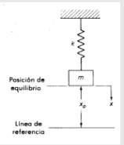
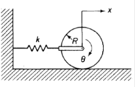
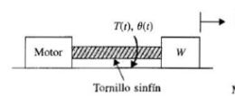
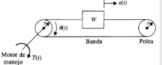
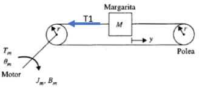
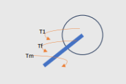

Felipe Cruz Pineda, Angie Vargas- M6A
# SISTEMAS MECANICOS 2 
En este apartado se hará un repaso de ciertas definiciones que tienen que ver con trabajo energía y potencia.

## 1. Trabajo:
>🔑 *Trabajo:* en este caso el trabajo es una medida de la realización del esfuerzo (fuerza)

Lo que nos quiere decir esta definición es que cuando uno aplica una fuerza se puede decir terminar o hallar cuánto trabajo se realizó al aplicar esta fuerza y se puede hallar con las siguientes fórmulas:

- $$W = Fx \quad \text{(N·m)}$$  
- **Trabajo total realizado**:  
  $$\int_0^x{kx \, dx} = \frac{1}{2}kx^2$$
  
  ## 2. Energia:
  
>🔑 *Energia:* En este caso cuando hablamos de inercia hablamos de la capacidad para realizar un trabajo.

la energía es lo que se emplea a la hora de realizar una fuerza a un trabajo esto por lo general se divide en 2 energías que estaremos puntualizando en este apartado que son la energía potencial y la energía cinética.

>🔑 *Energia potencial:* en los sistemas mecánicos la energía potencial cambia de acuerdo a la posición con respecto a una referencia. En este caso los resortes y las masas pueden almacenar energía potencial. Y esta energía potencial es equivalente al trabajo realizado por una fuerza externa.

Para esta energía potencial se puede utilizar la siguiente fórmula:

- $$U = \int_0^h{mg \, dx} = mgh$$

Donde unos indica que se vaya la energía potencial y donde MGH es la capacidad de hacer un trabajo con respecto a alguna altura establecida.

>🔑 *Energia cinetica:* esta energía es la que se produce por una velocidad.

En este caso solo eliminen todos de inercia pueden almacenar energía cinética de acuerdo con las siguientes fórmulas:

- $$T = \frac{1}{2}mv^2$$  
- $$T = \frac{1}{2}J\dot{\theta}^2$$

sin embargo se puede realizar un cambio en la energía cinética lo cual se basa en el trabajo realizado sobre una masa cuándo se le aplica una fuerza que acelera o desacelera esto este cambio se puede ver con las siguientes fórmulas:

$$\Delta T = \Delta W = \int_{x_1}^{x_2}{F \, dx} = \int_{t_1}^{t_2}{F \frac{dx}{dt} \, dt}$$

$$=\int_{t_1}^{t_2}{F_v \, dt} = \int_{t_1}^{t_2}{m \dot{v} v \, dt} = \int_{v_1}^{v_2}{mv \, dv} = \frac{1}{2}mv_2^2 - \frac{1}{2}mv_1^2$$
  
- $$\Delta T = \frac{1}{2}J\dot{\theta}_2^2 - \frac{1}{2}J\dot{\theta}_1^2$$  

## 3. Potencia:
>🔑 *Potencia:* en este caso la potencia se refiere a la realización de trabajo que puede variar con respecto al tiempo.

Esta potencia se puede terminar con las siguientes fórmula:
- $$P = \frac{dW}{dt}$$
    
- **Potencia media**:
$$\frac{\text{Trabajo Realizado en } (t_2 - t_1) \text{ segundos}}{(t_2 - t_1) \text{ segundos}}$$

Ya teniendo un repaso claro de todas nuestras definiciones podemos aplicarla a nuestros conceptos manejados en la anterior página como son los siguientes:

## 4. Energía potencial en un resorte:
>🔑 *Resorte:* energía potencial en un resorte se refiere al trabajo bonito hecho sobre sí mismo por las fuerzas que actúan en sus extremos cuando éste se comprime o se retrae.

para tener más claros estos conceptos se utilizan la siguiente:

$$
U = \int_0^x F\,dx = \int_0^x kx\,dx = \frac{1}{2}kx^2
$$

sin embargo de una forma general un cambio energía podría ser de la siguiente manera:

$$
\Delta U = \int_{x_1}^{x_2} F\,dx = \int_{x_1}^{x_2} kx\,dx = \frac{1}{2}kx_2^2 - \frac{1}{2}kx_1^2
$$

### 4.1. Potencia de un resorte:
En este caso la potencia requerida para estirar o comprimir un resorte se puede evaluar con la siguiente fórmula:

$$
P = \frac{dW}{dt} = \frac{F\,dx}{dt} = F\dot{x} = kx\dot{x}
$$

sabiendo que:

$$
U = \frac{1}{2}kx^2
$$

la anterior fórmula es la energía potencial de un resorte y obteniendo como resultado lo siguiente:

$$
P = kx\dot{x} = \dot{U}
$$

## 5. Potencia de una masa:
en este caso cuando se requiere una potencia para acelerar una masa qué va en línea recta procedimos a usar la siguiente fórmula:

$$
P = \frac{dW}{dt} = \frac{F\,dx}{dt} = F\dot{x} = mx\dot{x}
$$

sabiendo qué:

$$
T = \frac{1}{2}mv^2
$$
Esta fórmula viene a ser siendo la fórmula de energía cinética que posee una masa y dando como resultado lo siguiente:

$$
P = m\ddot{x}\dot{x} = m\dot{v}v = \dot{T}
$$

## 6. Energía disipada:
en este caso cuando estamos hablando de energía disipada nos vamos a enfocar en los amortiguadores y esta corresponde al trabajo neto que realiza este amortiguador. Esto se puede observar en la siguiente ecuación:

$$
\Delta W = \int_{x_1}^{x_2} F\,dx = \int_{x_1}^{x_2} b\dot{x}\,dx = b \int_{t_1}^{t_2} \dot{x} \frac{dx}{dt} \, dt = b \int_{t_1}^{t_2} \dot{x}^2 \, dt
$$

### 6.1. Potencia disipada en amortiguador:
En este caso la potencia disipada en él amortiguador en este caso de un cilindro se puede representar con la siguiente fórmula:

$$
P = \frac{dW}{dt} = \frac{F\,dx}{dt} = F\dot{x}
$$

sabiendo qué: 

$$
F = b\dot{x}
$$

y nos da como resultado lo siguiente:

$$
P = b\dot{x}^2
$$

## 7. Conservación de energía:

>🔑 *Conservación de energía:* es posible obtener el modelo matemático considerando que la energía total de un sistema permanece igual sin ninguna energía entra o sale del sistema. Por lo general en los sistemas mecánicos la fricción disipa energía en forma de calor y los sistemas que no incluyen flexión se denominan sistemas conservativos.

Esto quiere decir que hay alguna manera los sistemas buscar conservar cierta energía en cuanto se realiza osea hace algún tipo de trabajo o fuerza por lo que cuando no se incluye fricción se puede decir que los estos sistemas conservan cierta cantidad de energía.

### 7.1. Sistemas conservativos:

>🔑 *Conservación de energía:* en este caso toda la energía cinética y potencial sale del sistema en forma de trabajo mecánico y no se disipa energía,

Esto se puede evidenciar en la siguiente fórmula que es la que indica el trabajo neto que realiza una fuerza externa:

$$
\Delta(T + U) = \Delta W
$$

sin embargo si no sale una energía externa o no se entrega entonces se puede deducir lo siguiente:

$$
\Delta(T + U) = 0 \iff T + U = \text{Constante}
$$

💡**Ejemplo 1:** 

en este caso nos indica qué el ejercicio no tiene fricción por lo que es un sistema conservativo y lo podemos observar en la siguiente imagen:

    

Por lo tanto tenemos que resolver nos da lo siguiente:

$$
T + U = \frac{1}{2}m\dot{x}^2 + \frac{1}{2}kx^2 = \text{Constante}
$$

y procedemos a derivar la energía total que como resultado nos da lo siguiente:

$$
\frac{d}{dt}(T + U) = m\dot{x}\ddot{x} + kx\dot{x} = (m\ddot{x} + kx)\dot{x} = 0
$$

$$
m\ddot{x} + kx = 0
$$

💡**Ejemplo 2:** 

en el segundo ejemplo nos presenta un caso vertical en este caso se debe tener en cuenta la energía debido a la posición inicial ese caso se puede evidenciar en la siguiente imagen:

    

Continuando con nuestro caso procedemos a obtener la primera ecuación que en este caso va a ser el delta que significa el cambio de posición debido a nuestra posición inicial del ejercicio y es el siguiente:

$$
U_0 = mgx_0 + \frac{1}{2}k\delta^2
$$
en este caso sí este sistema está en equilibrio podemos emplear la siguiente ecuacion:
$$
k\delta = mg
$$

Por lo tanto las ecuaciones que nos quedan para resolver el problema son las siguientes:
$$
U = mg(x_0 - x) + \frac{1}{2}(k\delta + x)^2
$$

$$
= mgx_0 - mgx + \frac{1}{2}k\delta^2 + k\delta x + \frac{1}{2}kx^2
$$

$$
= mgx_0 + \frac{1}{2}k\delta^2 - (mg - k\delta)x + \frac{1}{2}kx^2
$$

$$
U = U_0 + \frac{1}{2}kx^2
$$

ya teniendo esas ecuaciones procedemos a implementar la ecuación de la energía cinética:

$$
T = \frac{1}{2}m\dot{x}^2
$$

y hallamos la energía total: 

$$
T + U = \frac{1}{2}m\dot{x}^2 + U_0 + \frac{1}{2}kx^2 = \text{Constante}
$$

y como último paso procedemos a derivar y al final obtenemos la ecuación del movimiento que es la siguiente:

$$
\frac{d}{dt}(T + U) = m\dot{x}\ddot{x} + kx\dot{x} = 0
$$

$$
(m\ddot{x} + kx)\dot{x} = 0
$$

$$
m\ddot{x} + kx = 0
$$

💡**Ejemplo 3:** 
En el ejemplo 3 nos dan un cilindro que no se desliza por lo que se considera un sistema conservativo:

    

entonces los empezamos a resolver con las siguientes fórmulas:

$$
J = \frac{1}{2}mR^2
$$

$$
x = R\theta
$$

$$
T + U = \frac{1}{2}m\dot{x}^2 + \frac{1}{2}J\dot{\theta}^2 + \frac{1}{2}kx^2 = \text{Constante}
$$

$$
\frac{3}{4}m\dot{x}^2 + \frac{1}{2}kx^2 = \text{Constante}
$$

$$
\frac{3}{2}m\dot{x}\ddot{x} + kx\dot{x} = 0
$$

$$
(m\ddot{x} + \frac{2}{3}k x)\dot{x} = 0
$$

$$
m\ddot{x} + \frac{2}{3}k x = 0
$$

ya cuando hemos de término nuestra ecuación procedemos a hallar lo que es energía cinética energía potencial y un movimiento rotacional que tiene nuestro cilindro y esto queda representado de la siguiente manera:

**Energía Cinética:**

$$
T = \frac{1}{2}m\dot{x}^2 + \frac{1}{2}J\dot{\theta}^2
$$

**Energía Potencial:**

$$
U = \frac{1}{2}kx^2
$$

**Movimiento Rotacional:**

$$
x = R\theta
$$

$$
\ddot{\theta} + \frac{2k}{3m}\theta = 0
$$

## 8. Conversión movimiento transnacional- rotacional:

### 8.1. Casos frecuentes:

en los casos frecuentes podemos observar 2 imágenes las cuales nos permiten ver cómo se fusionan los sistemas anteriores y que ecuaciones pueden ayudarnos a resolver estos sistemas:

    

$$
J = \frac{W}{g}\left(\frac{L}{2\pi}\right)^2
$$

    

$$
J = Mr^2 = \frac{2}{g}r^2
$$

### 8.2. Trenes de engranajes, palancas y bandas:

En este apartado también podremos observar ciertas imágenes que combinan engranajes palancas y bandas con su respectiva fórmula para su solución de sistemas:

    

$$
r_1 N_2 = r_2 N_1
$$

    

$$
\theta_1 r_1 = \theta_2 r_2
$$

$$
T_1 \theta_1 = t_2 \theta_2
$$

$$
\frac{T_1}{T_2} = \frac{N_1}{N_2} = \frac{\theta_2}{\theta_1}
$$

💡**Ejemplo 4:**
en este ejemplo se nos da un sistema qué tiene una masa unas poleas y un motor como en los casos anteriores debemos realizar nuestro diagrama de cuerpo libre primero y ahí sí resolver:

    

diagrama de cuerpo libre:

    

y procedemos a realizar la solución para hallar nuestras ecuaciones del sistema que como resultado da lo siguiente:

$$
T_m - T_1 - B_m \frac{d\theta}{dt} = J_m \frac{d^2\theta}{dt^2}
$$

$$
T_1 = Mr^2 \frac{d^2\theta}{dt^2}
$$

$$
T_m - Mr^2 \frac{d^2\theta}{dt^2} - B_m \frac{d\theta}{dt} = J_m \frac{d^2\theta}{dt^2}
$$

$$
\theta = \frac{y}{r}
$$

$$
T_m - Mr \frac{d^2y}{dt^2} - \frac{B_m}{r} \frac{dy}{dt} = \frac{J_m}{r} \frac{d^2y}{dt^2}
$$

## 10. Conclusiones
En conclusión, en esta sección podemos observar cómo muchos de los conceptos que ya poseíamos previamente pueden ser retomados y aplicados nuevamente para la construcción de modelos matemáticos en diversos gráficos. Además, es posible identificar la manera en que cada elemento posee características propias, como su energía, potencia y trabajo, las cuales pueden expresarse a través de fórmulas específicas. Estas ecuaciones nos permiten comprender mejor sus propiedades y, en consecuencia, desarrollar modelos matemáticos precisos que faciliten su análisis y resolución.

## 11. Referencias
(https://acrobat.adobe.com/id/urn:aaid:sc:US:77379dba-797d-43ee-96b6-6cad6c837216)
https://www.canva.com/design/DAGWSRhEhjU/4UJ2cu8t_VBxrxqtgmSBPA/edit
https://dademuchconnection.wordpress.com/wp-content/uploads/2017/07/dinamica_de_sistemas.p
