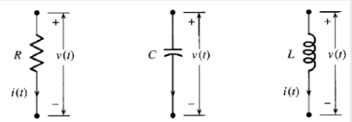
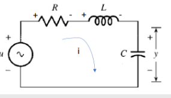
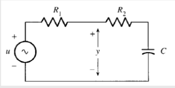
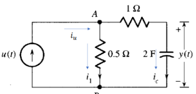

Felipe Cruz Pineda, Angie Vargas- M6A
# SISTEMAS ELECTRICOS
En este apartado procederemos a explicar un poco lo que son sistemas eléctricos y cómo se pueden hallar las ecuaciones de estos para modelar matemáticamente lo que se pide.

## 1. Circuito RLC:

    

>🔑 * circuito RLC:* este es un fenómeno físico que modela este comportamiento en las leyes de kirchoff y y se emplean las siguientes ecuaciones:

$$
R = \frac{v(t)}{l(t)}
$$

$$
i(t) = c\frac{dv(t)}{dt}
$$

$$
v(t) = L\frac{di(t)}{dt}
$$

💡**Ejemplo 1:** 

En este ejemplo procedemos a realizarlo por método de malla ya que es una trayectoria cerrada por lo que sus elementos están en serie y su corriente va hacia una misma dirección.

    

Para poder solucionar los debemos tener en cuenta lo siguiente:
- identificar cuántas mallas hay (en el caso de nuestro primer ejemplo sólo tenemos una malla cerrada)
- dibujar las Corrientes de las mallas( qué quiere decir esto hay que dibujar en qué sentido va la corriente cómo le indica la imagen)
- se debe también escribir los signos de cada elemento dependiendo hacia qué sentido va
- y por último se debe hallar la ecuación.

Solucionando ya nuestro ejemplo procedemos a aplicar la ley de kirchoff y nos da lo siguiente:

$$
-u(t) + V_R + V_L + y = 0
$$

lo que hicimos el anterior es nuestra ecuaciones del sistema la cual debemos reemplazar para hallar nuestro sistema de ecuaciones qué sería lo siguiente:

$$
u(t) + IR + L \frac{di}{dt} + y = 0
$$

esto debe estar en términos de la variable y sin embargo se puede observar que aún no está por lo que debemos pasarlos a términos de esta variable y nos da lo siguiente:

$$
I = I_c = C \frac{dy}{dt} \Rightarrow \frac{di}{dt} = L C \frac{d}{dt}\left( \frac{dy}{dt} \right)
$$

$$
-u(t) + RC \frac{dy}{dt} + LC \frac{d^2y}{dt^2} + y = 0
$$
  
## 📚Ejercicio 1:

En este ejercicio debemos obtener el modelo para  el circuito qué se muestra a continuación:

    

en este ejercicio podemos observar que tenemos 2 mallas y debemos hallar el valor de y por lo que a continuación se mostrará cómo podemos sacar nuestras ecuaciones para el modelo matemático eléctrico:

**Solución completa**:

$$
-U + V_{R_1} + V_{R_2} + V_C = 0
$$

$$
-U + j(R_1 + R_2) + V_C = 0
$$

$$
I = I_C = C \frac{dV_C}{dt}
$$

$$
-U + (R_1 + R_2)C \frac{dV_C}{dt}
$$

$$
\frac{U - y}{R_1} = \frac{y - V_C}{R_2} \Rightarrow \frac{V_C}{R_2} = y \left( \frac{1}{R_1} + \frac{1}{R_2} \right) - \frac{U}{R_1}
$$

$$
V_C = y \left( \frac{R_2}{R_1} + 1 \right) - \frac{R_2}{R_1} U
$$

$$
\frac{dV_C}{dt} = \frac{dy}{dt} \left( \frac{R_2}{R_1} + 1 \right) - \frac{R_2}{R_1} \frac{dU}{dt}
$$

$$
-u + (R_1 + R_2) C \frac{dy}{dt} \left( \frac{R_2}{R_1} + 1 \right) - \frac{R_2}{R_1} \frac{dU}{dt} + y \left( \frac{R_2}{R_1} + 1 \right) - \frac{R_2}{R_1} U
$$

## 2. Aplicándo nodos:
En este caso para realizar modelos matemáticos eléctricos también podemos no sólo aplicar el método de maya sino también el método de nodos qué es el método que a continuación vamos a explicar.

Este método también aplica la ley de kirchhoff pero en este caso de Corrientes LKC. Y se refiere a un nodo como un punto de conexión de uno o varios elementos sólo se le aplica corriente en los nodos qué dividen este y a continuación mostraremos un ejemplo de cómo se pueden aplicar los nodos.

💡**Ejemplo 2:** 

    

en este caso procedemos a aplicar las siguientes ocasiones de la siguiente manera y teniendo como resultado lo siguiente:

**LKC**:

$$
\sum i = 0
$$

$$
i_u - i_1 - i_c = 0
$$

$$
i_u(t) - \frac{V_{AB}}{0.5} - 2 \frac{dy(t)}{dt} = 0
$$

$$
V_{AB} = i_c \cdot 1 + y(t) \Rightarrow V_{AB} = 2 \frac{dy(t)}{dt} + y(t)
$$

$$
u(t) - \frac{2}{0.5} \frac{dy(t)}{dt} - \frac{1}{0.5} y(t) - 2 \frac{dy(t)}{dt} = 0
$$

$$
u(t) = -6 \frac{dy(t)}{dt} - 2y(t)
$$

## 📚Ejercicio 2:
por último realizamos la siguiente actividad:

    

la cual aplicando los métodos anteriormente utilizados nos da resultado las siguientes ecuaciones y modelos matemáticos:

$$
e_i(t) - i_{c_1} - i R_2 = 0
$$

$$
V_C = i \cdot \frac{dV(t)}{dt}
$$

$$
e_i(t) - \frac{V_{AB}}{C_1} - C_2 \frac{de_0}{dt} = 0
$$

$$
e_i(t) = C_1 \frac{dV_{AB}}{dt} - C_2 \frac{de_0}{dt}
$$

$$
I_1 + I_2 + I_3 = 0
$$

$$
\frac{e_i - e_x}{R_1} + C_1 \frac{d(o - e_x)}{dt} + \frac{e_0 - e_x}{R_2} = 0
$$

$$
-e_x = V_{R_2} + e_0 \Rightarrow -e_x = R_2 I_3 + e_0
$$

$$
I_3 = C_2 \frac{de_0}{dt} \Rightarrow -e_x = R_2 C_2 \frac{de_0}{dt} + e_0
$$

## 10. Conclusiones
Agregue unas breves conclusiones sobre los temas trabajados en cada clase, puede ser a modo de resumen de lo trabajado o a indicando lo aprendido en cada clase

## 11. Referencias
Agregue un subtítulo al final donde pueda poner todas las referencias consultadas incluyendo el origen o fuente de los ejercicios planteados. Tambien dentro del texto referencie los textos o artículos consultados y las figuras y tablas dentro de la explicación de las mismas.
