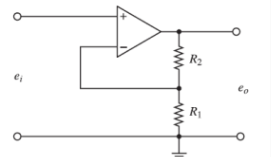
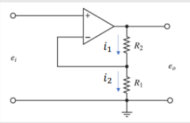
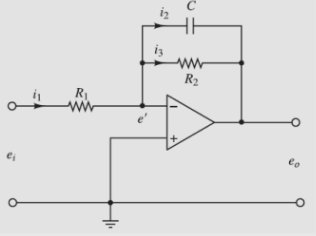
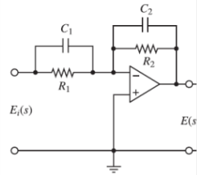

Felipe Cruz Pineda, Angie Vargas- M6A
# CIRCUITOS CON AMPLIFICADORES OPERACIONALES:

En la última clase el segundo corte antes del parcial se explicó los sistemas eléctricos pero basados en circuitos con amplificadores operacionales que es lo que vamos a profundizar en este apartado.

## 1. Amplificador no inversor:

    

En este suelen utilizar las leyes de kirchhoff y el modelo simplificado de amplificador operacional.
Unas de las pautas que hay que tener muy en cuenta de esto son las:Unas de las pautas que hay que tener muy en cuenta de esto son las siguientes:

- la tensión en ambas entradas del amplificador son iguales V+ = V-
- la corriente en las entradas del amplificador ese 0
- la impedancia de la entrada es muy grande
- la impedancia de salida es muy pequeña
  

💡**Ejemplo 1:** 

En este ejemplo procedemos a realizarlo por método de malla ya que es una trayectoria cerrada por lo que sus elementos están en serie y su corriente va hacia una misma dirección.

    

Para poder solucionar los debemos tener en cuenta lo siguiente:
- identificar cuántas mallas hay (en el caso de nuestro primer ejemplo sólo tenemos una malla cerrada)
- dibujar las Corrientes de las mallas( qué quiere decir esto hay que dibujar en qué sentido va la corriente cómo le indica la imagen)
- se debe también escribir los signos de cada elemento dependiendo hacia qué sentido va
- y por último se debe hallar la ecuación.

Se prefiere utilizar el método de nor sin embargo la salida del amplificador no lo analizamos nunca debido a que hay que analizar el circuito del amplificador antes. Teniendo esto un poco más claro podemos observar que estos circuitos se pueden basar en las siguientes ecuaciones:

$$
I_1 - I_2 = 0
$$

$$
\frac{e_0 - V_x}{R_2} - \frac{V_x - 0}{R_1} = 0
$$

$$
V_x = e_i
$$

$$
\frac{e_0 - e_i}{R_2} - \frac{e_i}{R_1} = 0
$$

$$
e_0 = e_i \left( \frac{1}{R_2} + \frac{1}{R_1} \right) R_2 \Rightarrow e_0 = e_i \left( 1 + \frac{R_2}{R_1} \right)
$$

### con elementos almacenadores de energía:

    

$$
i_1 - i_2 - i_3 = 0
$$

$$
\frac{e_i - e'}{R_1} - \frac{e' - e_0}{R_2} - C \frac{d(e' - e_0)}{dt} = 0
$$

$$
e' = 0
$$

$$
\frac{e_i}{R_1} - \frac{-e_0}{R_2} - C \frac{d(-e_0)}{dt} = 0
$$

$$
\frac{e_i}{R_1} = -\frac{e_0}{R_2} - C \frac{d(e_0)}{dt}
$$

## 📚Ejercicio 1:
En esta actividad procederemos a solucionar un ejercicio dejado en clase:

    

Dando como resultado lo siguiente:

$$
i_1 + i_2 - i_3 = i_4 = 0
$$

$$
E_i - V_x \Rightarrow \text{multi}
$$

$$
e_i \frac{d(E_i - V_x)}{dt} + \frac{E_i - V_x}{R_1} - \frac{R_2 \, dV_x - E}{dt} - \frac{V_x - E}{R_2} = 0
$$

$$
V_x = 0
$$

$$
e_i \frac{dE_i}{dt} + \frac{E_i}{R_1} + L_2 \frac{dE}{dt} + \frac{E}{R_2} = 0
$$

## 10. Conclusiones
En conclusión los sistemas eléctricos permiten modelar y simular el comportamiento de redes eléctricas bajo distintos escenarios. Además, se pone a prueba la estabilidad del sistema, lo que resulta clave para evaluar el funcionamiento del circuito y su diagrama. A través del modelo matemático, se pueden analizar diferentes condiciones y encontrar soluciones óptimas para mejorar la eficiencia y confiabilidad del sistema eléctrico.

## 11. Referencias
https://acrobat.adobe.com/id/urn:aaid:sc:US:118ebe01-b47f-43bc-94ec-d83ea4d8d95c
https://www.canva.com/design/DAGWSRhEhjU/4UJ2cu8t_VBxrxqtgmSBPA/edit
https://dademuchconnection.wordpress.com/wp-content/uploads/2017/07/dinamica_de_sistemas.pdf)
