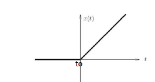

Felipe Cruz Pineda, Angie Vargas- M6A
# Correccion Parcial 2
En esta sesión se procederá a realizar la corrección del parcial del segundo corte. 
En esta ocasión se hizo 2 parciales distintos unos para números pares y otros para números impares sin embargo se llevan a realizar los cuatro ejercicios de los 2 parciales:

## PARCIAL 1:
### 📚Ejercicio 1:
Para este ejercicio procedemos como primer paso a realizar los diagramas de cuerpo libre para poder observar como se comportan las masas del sistema.

 

    

En esta ocacion tenemos la imagen del cuerpo libre para la primera masa donde reaccionan las fuerzas que se ven en la imagen dando como resultado las sigueientes ecuaciones:
 
 
$$
U+F _{w1} - F _{k2} -F _{B1} -F _{B2} -F _{B3} - F _{k1} = m _{1} * a _{m1}
$$

Pasamos a reemplazar lo que es la ecuacion por las otras formulas para tener la ecuacion mas completa:

$$
U+M _{1}G - K _{1}Y _{1} -B _{1}Y _{1} -B _{2}Y _{1}-B _{3}(Y _{1}-Y _{2})- K _{1}(Y _{1}-Y _{2}) = m _{1} * Y _{1}
$$

Para la masa dos hacemos lo mismo dando como resultado lo siguiente:

 

    

$$
IK= F_{w2} -F_{B3} = m_{2}*Y_{2}
$$

De nuevo realizamos el reemplazo para poder tener la ecuacion completa:

$$
K (y_{1}-y_{2}) + m_{2}g -B(Y_{1}-Y_{2}) = m_{2}*Y_{2}
$$

Con esto tenemos las dos ecuaciones que dan respuesta al primer problema del parcial.

## 📚Ejercicio 2:

En el siguiente punto tenemos un sistema electrico al cual tambien debemos halklar las ecuaciones que rigen este sistema

 

    

por mallas:

$$
-e(t)+V_{i}+V_{200}+V_{50}=+50(I_{1}-I_{2})=0                            
$$ 

$$
IC= CDV/DT 
$$

$$
-e(t)+2I_{1}+200I_{1}+50(I_{1}-I_{2})=0     
$$

$$
V_{50}+V_{20}+V_{1}=0 
$$

$$
50(I_{2}-I_{1})+20I_{2}+1/C\int I_{2}dt = 0
$$

Esta termina siendo la ecuacion que resuelve el sistema electrico.

## PARCIAL 2:

## 📚Ejercicio 3:
Para este parcial tambien se da un modelo mecanico el cual debemos hallar sus ecuaciones para solucionar el sistema.
Como primer paso tenemos de nuevo que realizar los diagramas de cuerpo libre para cada masa.

Para la masa 1:

 

    

En este caso tenemos las siguientes ecuaciones para la primera masa:

$$
U-FK-FB=0
$$

Reemplazando por las formulas para una ecuacion concreta y mas puntual

$$
U-K(Y-X)-B(Y-X)=0
$$

Ahora tenemos la masa 2.
Para este caso realizamos tambien un diagrama de cuerpo libre para saber como se comporta.

 

    

A continuacion porcedemos a sacar la ecuacion que representa el sistema.

$$
FK+FB=M_{am}
$$

por lo que reemplazando por las formulas:

$$
K(Y-X)+B(Y-X)=MY
$$

## 📚Ejercicio 4:
Para este parcial tambien se dio un sistema electrico que es el siguiente:

 

    

$$
-e + V_L + V_{200} + V_{50} = 0
$$

$$
-e(t) + 2\dot{I}_1 + 200 I_1 + 50(I_1 - I_2) = 0
$$

$$
V_{50} = V_x, \quad V_C = 0
$$

$$
(50(I_1 - I_2) + 200 I_2 + \frac{1}{C} \int I_2 \)
$$

 este es muy parecido al anterior sin embargo responde preguntas distintas.

---
## 1. Conclusiones
En este caso, podemos observar cómo es posible abordar la solución de este tipo de ejercicios, aplicando estrategias matemáticas y conceptuales adecuadas. Durante el parcial, estos problemas fueron resueltos utilizando todos los conocimientos adquiridos en el primer corte, lo que permitió reforzar la comprensión y el manejo de los principios fundamentales.

## 2. Referencias
(https://dademuchconnection.wordpress.com/wp-content/uploads/2017/07/dinamica_de_sistemas.pd)
