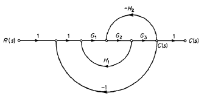

Felipe Cruz Pineda, Angie Vargas- M6A
# FUNCIÓN DE TRANSFERENCIA 
En este apartado se procederá a explicar el tema de función de transferencia y cómo se puede realizar o resolver esta misma a continuación dejaremos la explicación:

>🔑 * función de transferencia:* En el área de control se usa otro tipo de representación matemática de denominada función de transferencia.
>Esta consiste en una transformada de laplace de la ecuación diferencial.

 Básicamente lo que nos quiere decir esto es que la función de transferencia es una representación matemática que se encuentra en el dominio de la plaza logrando que se pueda analizar la salida sobre la entrada del sistema.
 
 A continuación se representa tara este concepto con una fórmula para entenderla mejor:
 
$$
Se despeja $\frac{salida}{Entrada}$ es decir: $\frac{Y(s)}{U(s)}$
$$

se debe tener en cuenta que para este caso las entradas o condiciones iniciales de la ecuación diferencial van a ser iguales a cero sin embargo sólo se aplica este caso sí se van a hacer funciones de transferencia en el caso de querer solucionar ecuación diferencial puntualmente son necesarias las condiciones iniciales y no necesariamente van a ser cero.

    

Lo que quiere decir esto es una breve explicación de que un sistema consta de varios elementos eh conectados entre sí cuyo objetivo es realizar algún procedimiento o lograr un objetivo común.
En la gráfica mencionada, se pueden identificar distintos tipos de sistemas, cada uno diseñado para cumplir con un propósito específico.

## 1. Principio general de modelamiento:

    

En la anterior imagen se puede observar lo que es el principio general de modelamiento en pocas palabras el balance de masa o energía representado en dinámica de sistemas la anterior imagen es la ecuación de masa y energía.

## 2. Sistemas mecánicos:
En este punto se estará hablando de sistemas donde se utilizan elementos como la masa el resorte y el amortiguador definiendo así otros tipos de variables que influyen en estos sistemas mecánicos como la fricción ir solucionando ejemplos para entender su funcionamiento.

### 2.1. Resortes:
>🔑 *Resorte:* elemento que tiene una forma que almacena energía mecánica que al comprimirlo busca su estado de reposo nuevamente.

Básicamente los resortes son elementos que pueden almacenar energía mecánica en este caso se pueden estirar o comprimir lo que hace que este elemento vuelva a su estado de reposo.

    

    

A continuación procedemos a ver una de las ecuaciones que representa un resorte el cual tiene sus 2 extremos colocados en alguna superficie:

$$
F = kx = k(x_1 - x_2)
$$

### 2.2. Amortiguador:
>🔑 *Amortiguador:* Dispositivo que sirve para compensar y disminuir el efecto de choques, sacudidas o movimientos bruscos en aparatos mecánicos.

En este caso este es un elemento que genera friccion propia por lo que puede reducir y compensar algun choque a diferencia del resorte que este se devuelve a su posicion de reposo.

    

En la imagen se puede observar cómo un amortiguador tiene un comportamiento lineal que es completamente proporcional al desplazamiento y la velocidad de este desplazamiento.

A continuación procederemos a observar una de las ecuaciones que representa el amortiguador:

$$
F = b\dot{x} = b(\dot{x}_1 - \dot{x}_2)
$$

En cuanto a esta ecuación es un principio que se utiliza para representar la fricción entre una masa y la superficie y este se le denomina constante de fricción viscosa

## 3. Tipos de friccion:
### 3.1. Friccion  en seco:
>🔑 *Friccion en seco:* la fricción en seco es aquella que se presenta cuando un cuerpo con una superficie no lubrica y se desliza sobre otra superficie no lubrica.

Básicamente lo que nos quiere decir esto es que ninguna de las superficies tiene algún tipo de lubricación que pueda facilitar el deslizamiento por lo que se va a producir una fricción en seco que quiere decir que las 2 partes quieren chocan no tienen la suficiente lubricación para trabajar de manera adecuada.

    

en la imagen podemos observar un diagrama de cuerpo libre que tiene una fricción en seco lo que quiere decir que el cuadrado huelva jugo que se presenta en la imagen no tiene ningún tipo de líquido y la superficie en la que está tampoco por lo que al desplazarse va a tener una fricción en seco.

En general existen también distintos tipos de fricción como fricción estática fricción por desplazamiento y fricción por rodamiento en este caso puntualmente estaremos especificando lo que es fricción por rodamiento.

 ### 3.2. Friccion por rodamiento:
 >🔑 *Friccion por rodamiento:* es esta fricción se da por una fuerza que se opone el movimiento de un cuerpo que se encuentra rodando por una superficie esta fuerza surge debido a las deformaciones qué tienen las interacciones mutuas moleculares entre sí.

Básicamente lo que nos quiere decir esto es que la fricción por rodamiento es aquella que cuando un cuerpo en este caso con forma de circunferencia o en general se puede producir esta fricción ya que siempre va a haber una fuerza que se oponga al movimiento cuando este esté desplazándose.

    

## 4. Sistemas mecanicos:
En este apartado estaremos viendo cómo se puede generar un sistema aplicando masa resorte y amortiguador.

### 3.1. Sistema masa-resorte-amortiguador:
a continuación se va a presentar una imagen donde se va a evaluar sufren a mi no físico que modela el sistema y cómo se puede resolver:

    

en este caso para poder sacar un modelo matemático del sistema procederemos a utilizar las siguientes ecuaciones:

- $$F_R = k_2 \cdot X \quad \longrightarrow \text{Ley de Hooke}$$
- $$F_F = k_1 \cdot V_m \quad \longrightarrow \text{Fricción viscosa}$$
- $$F = m \cdot a \quad \longrightarrow \text{Leyes de Newton}$$

estas son las ecuaciones que utilizaremos para poder resolver de ahora en adelante nuestros sistemas masa resorte y amortiguador.

Ya cuando tenemos este punto proseguimos hacer un diagrama de cuerpo libre de la masa qué tenemos para saber qué fuerzas están ejerciendo sobre esta y cómo procedemos ayer nuestras ecuaciones queda como resultado lo siguiente:

    

dónde u significa la fuerza que se le está ejerciendo la masa FR la fuerza que tiene el resorte o la fuerza que está ejerciendo el resorte en la masa Y FF la fuerza de fricción que está ejerciendo esa masa contra la superficie.

Después de esto se procede a realizar o hallar las ecuaciones:

Primero tomamos las direcciones en qué están esas fuerzas y las organizamos en una ecuación:

$$
u - F_R - F_F = m \cdot a
$$

Esta ecuación lo que nos indica es que todas las fuerzas que tomamos en el diagrama libre las organizamos y nos da la ecuación para poder reemplazar encontrar nuestras ecuaciones del sistema.

Luego de esto procedemos a reemplazar con las fórmulas que vimos inicialmente todo en funciones de t por lo que nos quedaría lo siguiente:

$$
F_R = k_2 \cdot y(t)
$$

$$
u(t) - k_2 \cdot y(t) - F_F = m \cdot a
$$

$$
F_F = k_1 \cdot \frac{dy(t)}{dt}
$$

$$
u(t) - k_2 \cdot y(t) - k_1 \cdot \frac{dy(t)}{dt} = m \cdot a
$$

$$
a = \frac{d^2 y(t)}{dt^2}
$$

$$
u(t) - k_2 \cdot y(t) - k_1 \cdot \frac{dy(t)}{dt} = m \cdot \frac{d^2 y(t)}{dt^2}
$$

Luego de reemplazar con las fórmulas que hicieron inicialmente procedemos a tener el modelo matemático de nuestro sistema masa resorte amortiguador.

💡**Ejemplo 1:** 
En este ejemplo uno se debe encontrar el modelo matemático para el sistema que representa la suspensión de un automóvil.

    

Siguiendo los pasos de lo anterior procedimos a hacer el diagrama de cuerpo libre qué queda de la siguiente manera:

    

ya teniendo nuestro diagrama proseguimos hacer ya ya nuestras ecuaciones que quedan de la siguiente manera:

$$
u + F_N - F_R - F_F = m \cdot a
$$

$$
-u - F_w + F_R - F_F = -m \cdot a
$$

$$
u(t) + m \cdot g - k_2 \cdot y(t) - K \cdot \dot{y}(t) = m \cdot \ddot{y}(t)
$$

## 5. Sistemas mecanicos mas complejos:
en este ejemplo o diagrama se van a presentar 2 meses 3 resortes y un amortiguador conectados entre sí como se ve en la imagen por lo que va a ser un poco más complejo y se va a desarrollar de la siguiente manera:

    

Nuevamente lo que vamos a hacer es realizar los diagramas de cuerpo libre en este caso procedemos a hacer uno para cada masa que hay en el diagrama:

### Para la masa 1:

    

y a continuación lo que haremos es realizar y hallar nuestras ecuaciones de la siguiente manera:

$$
u - F_{R1} - F_{R2} - F_F = m_1 \cdot a_{m1}
$$

$$
u(t) - k_1 \cdot x_1(t) - k_2 \cdot (x_1(t) - x_2(t)) - b \cdot \frac{d(x_1(t) - x_2(t))}{dt} = m_1 \cdot \frac{d^2 x_1(t)}{dt^2}
$$

en este CV tomar en cuenta que la iluminación no estiramiento el resorte depende del movimiento de ambas masas de igual manera la velocidad del émbolo del amortiguador del resorte en este caso número 2 depende la movilidad también de las 2:00 masas.
Ya teniendo las ecuaciones para nuestra masa uno procedemos a hacer la masa 2.

### Para la masa 2:

    

para esta masa próximos de igual manera a hacer lo mismo que es hallar nuestras ecuaciones de la siguiente manera:

$$
u - F_{R2} + F_F - F_{R3} = m_2 \cdot a_{m2}
$$

$$
k_2 \cdot (x_1(t) - x_2(t)) + b \cdot \frac{d(x_1(t) - x_2(t))}{dt} - k_3 \cdot x_2(t) = m_2 \cdot \frac{d^2 x_2(t)}{dt^2}
$$

Ya teniendo como resultados nuestras 2 mases procedemos a hacer nuestro modelo resultante que es el siguiente:

$$
u(t) - k_1 \cdot x_1(t) - k_2 \cdot (x_1(t) - x_2(t)) - b \cdot \frac{d(x_1(t) - x_2(t))}{dt} = m_1 \cdot \frac{d^2 x_1(t)}{dt^2}
$$
$$
k_2 \cdot (x_1(t) - x_2(t)) + b \cdot \frac{d(x_1(t) - x_2(t))}{dt} - k_3 \cdot x_2(t) = m_2 \cdot \frac{d^2 x_2(t)}{dt^2}
$$
## 6. Sistemas rotacional:
 >🔑 * sistema rotacional:* es un fenómeno mecánico donde la naturaleza el movimiento cambia y se convierte en un movimiento angular.

Por lo que al ser un movimiento rotacional van a cambiar sus leyes y sus fórmulas para poder hallar nuestro sistema matemático por lo cual si van a utilizar las siguientes ecuaciones:

- $$F_R = k \cdot \varphi \quad \longrightarrow \varphi \text{ es un ángulo de torsión}$$  
- $$F_F = b \cdot \frac{d\varphi}{dt} \quad \longrightarrow \frac{d\varphi}{dt} \text{ es la velocidad angular}$$  
- $$T = J \cdot \frac{d^2\varphi}{dt^2} \quad \longrightarrow J \text{ es el momento de inercia}$$  

a continuación procedemos a hacer el mismo procedimiento que se lleva a cabo en lo anterior que como primer paso tiene hacer el diagrama de cuerpo libre en este caso de nuestro sistema de rotación:

    

luego procedemos a realizar nuestra actuación y finalmente arre plaza la dando como resultado lo siguiente:

- $$T - F_R - F_F = J \cdot a \quad \longrightarrow a \text{ es la aceleración angular}$$  
- $$T(t) = F_F = J \cdot a \quad \longrightarrow a \text{ es la aceleración angular}$$  
- $$T(t) - k \cdot \theta(t) - b \cdot \frac{d\theta(t)}{dt} = J \cdot \frac{d^2\theta(t)}{dt^2}$$  

💡**Ejemplo 2:**
en este caso el ejemplo 2 es un ejemplo de sistema masa resorte amortiguador de manera vertical por lo que tenemos la siguiente imagen de referencia para realizar el ejercicio:

    

se procede a hacer el diagrama de cuerpo libre queda como resultado lo siguiente:

### Para la masa 1:

    

### Para la masa 2:

    

y por último procedemos a realizar nuestras ecuaciones dando lo siguiente:

$$
F_{r_2} + F_w - F_{k_1} - F_{F_1} = m_1 a_1
$$

$$
K_2(x_1 - x_2)(t) - K_1 y(t) + b \cdot \dot{y}(t) = m_1 \cdot \dot{y}(t)
$$

$$
0.1(x_1(t) - x_2(t)) = 0.1y(t) + 0.05\dot{y}(t) = 10 \, \text{kg} \cdot \ddot{y}(t)
$$

## 7. Ejercicios externos: 

## 📚Ejercicio 1:

    

en este ejercicio tenemos un sistema mecánico por lo que vamos allá su sistema de ecuaciones:
 realizamos el paso a paso y en este caso pues diseñamos el diagrama de cuerpo libre qué es el siguiente:

    

y por último pasamos a allá en nuestras ecuaciones que quedan de la siguiente manera:

$$
a=\frac{d^2}{dt^2}y(t)
$$

$$
f_B(t)=B\frac{d}{dt}y(t)
$$

$$
f_{k_{1}}(t)=k_1y(t)
$$

$$
f_{k_{2}}(t)=k_2y(t)
$$

$$
f(t)-f_{k_1}(t)-f_{k_2}-f_g(t) = M\cdot a
$$

$$
f(t) -K_1y(t) - K_2y(t)-B\frac{d}{dt}y(t) = M\frac{d^2}{dt^2}y(t)
$$

## 📚Ejercicio 2:

    

En este ejercicio que se ve en la imagen también debemos hallar sus ecuaciones por lo que procedimos a hacer primeramente el diagrama de cuerpo libre.

    

ya teniendo nuestro diagrama de cuerpo libre pero seguimos ayer nuestras ecuaciones de la siguiente manera:

$$
a = \frac{d^2}{dt^2}y_2(t)
$$

$$
f_B(t)=B\frac{d}{dt}y_2(t)
$$

$$
f_k(t) = K[y_1(t)-y_2(t)]
$$

$$
f_k(t)-f_B(t)  =M\cdot a
$$

$$
K[y_1(t)-y_2(t)]-B\frac{d}{dt}y_2(t)=M\frac{d^2}{dt^2}y_2(t)
$$

$$
Ky_1(t)-Ky_2(t)-B\frac{d}{dt}y_2(t)=M\frac{d^2}{dt^2}y_2(t)
$$

$$
K_y1(t) = M\frac{d^2}{dt^2}y_2(t)+B\frac{d}{dt}y_2(t) + K y_2(t)
$$

## 8. Conclusiones
En conclusión, en este apartado podemos observar que muchos elementos mecánicos no solo requieren una ecuación para su análisis, sino también la aplicación de una fuerza externa. Además, hemos aprendido la importancia de realizar un diagrama de cuerpo libre, ya que este nos permite identificar las fuerzas que actúan sobre el cuerpo y comprender su comportamiento.
Asimismo, dependiendo del tipo de elemento anclado a la masa, este adquirirá ciertas propiedades específicas. Por ejemplo, en el caso de un resorte, este se estirará o se comprimirá según la fuerza aplicada, mientras que un amortiguador generará fricción para disipar energía. Estos principios, junto con otros conceptos, nos ayudan a determinar el funcionamiento del modelo y a desarrollar las ecuaciones necesarias para construir un sistema mecánico basado en modelos matemáticos.

## 9. Referencias
https://acrobat.adobe.com/id/urn:aaid:sc:US:71394447-b9cc-4ebe-8898-e8731e65012f
https://www.canva.com/design/DAGWSRhEhjU/4UJ2cu8t_VBxrxqtgmSBPA/edit
https://dademuchconnection.wordpress.com/wp-content/uploads/2017/07/dinamica_de_sistemas.pdf
