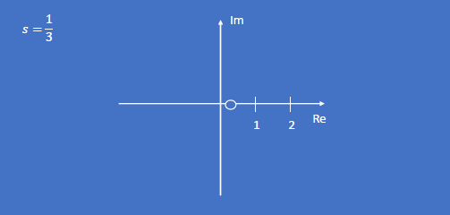
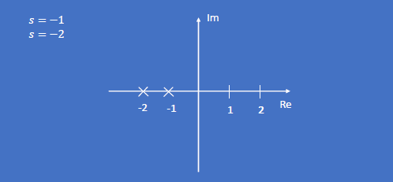
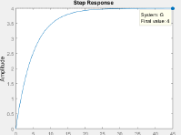
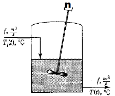
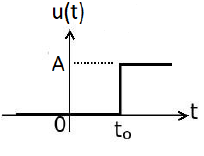
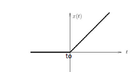
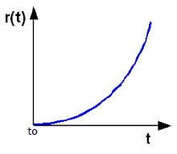

Felipe Cruz Pineda, Angie Vargas- M6A
# FUNCIÓN DE TRANSFERENCIA 
En este apartado se procederá a explicar el tema de función de transferencia y cómo se puede realizar o resolver esta misma a continuación dejaremos la explicación:

>🔑 * función de transferencia:* En el área de control se usa otro tipo de representación matemática de denominada función de transferencia.
>Esta consiste en una transformada de laplace de la ecuación diferencial.

 Básicamente lo que nos quiere decir esto es que la función de transferencia es una representación matemática que se encuentra en el dominio de la plaza logrando que se pueda analizar la salida sobre la entrada del sistema.
 
 A continuación se representa tara este concepto con una fórmula para entenderla mejor:
 
$$
Se despeja \frac{salida}{Entrada} es decir: \frac{Y(s)}{U(s)}
$$
>[!NOTE]
> se debe tener en cuenta que para este caso las entradas o condiciones iniciales de la ecuación diferencial van a ser iguales a cero sin embargo sólo se aplica este caso sí se van a hacer funciones de transferencia en el caso de querer solucionar ecuación diferencial puntualmente son necesarias las condiciones iniciales y no necesariamente van a ser cero.

## 1. CLASIFICACIÓN DE LAS FUNCIONES DE TRANSFERENCIA:
Antes de la clasificación de estas funciones se debe tener en cuenta como puede lucir una función de transferencia por lo que a continuación veremos cómo se puede expresar esta misma:

>🔑 * una función de transferencia se puede expresar de la siguiente manera:*

$$
G(s) =\frac{N(s)}{D(s)}
$$

- Donde $N(s)$ y $D(s)$ son polinomios de la variable "s".
- si se denomina n al grado del polinomio del numerador.
- sí se denomina m al grado del polinomio del denominador.

Teniendo encuenta cómo se ve la función de transferencia y qué componentes tiene procedemos a ver la clasificación de estas:

### 1.1. funcion de tranferencia impropia:
En este caso se le denomina función impropia cuando tenemos que el grado del numerador en la función de transferencia es más grande que el denominador esto quiere decir qué son sistemas que tienen energía en la salida pero  no en la entrada.

$$
n>m \longrightarrow Impropia 
$$

### 1.2. funcion de tranferencia estrictamente propia:
En este caso se le denomina la función estrictamente propia cuando el denominador tiene un número mayor que el numerador esto se puede evidenciar en los sistemas que recién energía y la transforma.

$$
m>n \longrightarrow Estrictamente Propia
$$

### 1.2. funcion de tranferencia estrictamente propia:

Por último se le denomina función bipropia a las funciones de transferencia qué tienen numerador y denominador iguales, esto básicamente se trata de un modelo no desarrollado adecuadamente por lo que quiere decir que en estos sistemas la energía responde exactamente cuando no debe y hay fallas en el modelamiento.

$$
n=m \longrightarrow Bipropia
$$

Básicamente estás clasificaciones sirve para mirar la dinámica y el comportamiento del sistema esto quiere decir que podemos analizar cómo se está transformando la energía del sistema con estas clasificaciones de las funciones de transferencia.

💡**Ejemplo 1:** 
En este ejemplo vamos a evidenciar cómo podemos hallar o analizar los distintos tipos o clasificación de las funciones de transferencia.

a).

$$
s^2+1 \longrightarrow Impropia
$$

b).

$$
2 \longrightarrow Bipropia
$$

c).

$$
\frac{1}{s+1} \longrightarrow Extrictamente propia
$$

d).

$$
\frac{(s^2-1)}{s+1} \longrightarrow Impropia
$$

e).

$$
\frac{(s^2-1)}{s+1} \longrightarrow Impropia
$$

f).

$$
\frac{s-1}{s+1} \longrightarrow Bipropia
$$

## 2. ZEROS DE UNA FUNCIÓN DE TRANSFERENCIA:

En este caso hablaremos de los ceros de una función de transferencia y a qué se refieren con esto:

>🔑 * Zeros de una funcion de transferencia:*
>- Si se iguala la N(s) a 0 se obtienen los valores de "s" que cumplen con la condición.
>- Si el numerador se hace 0 toda la función de transferencia se vuelve cero de ahi sale el nombre para estos valores de "s".
>- Estos valores pueden ser reales o complejos por lo tanto se pueden ubicar en el plano cartesiano.

lo que nos quiere decir esto es que los ceros de una función son los valores DS qué hacen que toda esta función tiende a cero ya sean valores reales o valores complejos para hallar estos ceros siempre se debe intentar que el numerador sea cero y en las gráficas se representa con un círculo.

### 2.1. Como hallar los zeros de una función de transferencia:

$$
G(s) = \frac{Y(s)}{U(s)} = \frac{3s-1}{s^2+3s+2} = \frac{N(s)}{D(s)}
$$

En este caso tenemos un ejemplo de función de transferencia a la cual le vamos a sacar sus seres correspondientes:

$$
N(s) = 0 \quad\quad 3s-1 = 0
$$

$$
s = \frac{1}{3} \longrightarrow s $ es  un  número  complejo
$$

### 2.2. Ubicacion de los zeros:
El siguiente paso para continuar con el tema es ubicar los ceros en la gráfica por lo que a continuación mostraremos la gráfica de los ceros de nuestra función de transferencia anterior:

    

💡**Ejemplo 2:**

## 3. POLOS DE UNA FUNCIÓN DE TRANSFERENCIA:

>🔑 * Polos de una funcion de transferencia:*
>- Si se iguala D(s) a 0se obtiene los valores de "s" que cumplen con la condición.
>- Si el denominador se hace 0 toda la función de transferencia se vuelve infinito de ahi el nombre para estos valores de "s".
>- Estos valores pueden ser reales o complejos por lo tanto se pueden ubicar en un plano cartesiano.

En este caso cuando nos referimos a los polos nos referimos al valor de ese que me lleva la función o me hace tender la función a infinito.

### 3.1. Como hallar los polos de una función de transferencia:

$$
G(s) = \frac{Y(s)}{U(s)} = \frac{3s-1}{s^2+3s+2} = \frac{N(s)}{D(s)}
$$ 

De esta manera se halla en los polos de la funcion a continuación daremos el resultado de estos:
 
$$
D(s) = 0 \quad\quad s^2 + 3s+2 = 0
$$

$$
(s+1)(s+2) = 0
$$

En este caso se realiza factorizacion para que se pueda solucionar los polos: 

$$
s = -1
$$

$$
s = -2
$$

### 3.2. Ubicación de los polos 

    

### 3.3. Ubicación general de los polos y los zeros en la grafica:
En este apartado podremos observar una gráfica donde se podrán ver los polos representados con una x.

    

💡**Ejemplo 3:** 
En este caso haremos un ejemplo para la explicación de del tema de los polos.

$$
\frac{(s+2)}{(s+3)(s^2+0.5s+1)}
$$

## 4. GRADO DE UNA FUNCIÓN DE TRANSFERENCIA

>🔑 *Grados de una funcion de transferencia:*
> Otra forma de clasificar las funciones de transferencia es por su orden o grado
> Esto lo define el polinomio caracteristico

💡**Ejemplo :** Un ejemplo de esto es de como se puede ver el grado de la funcion de transferencia.

$$
G(s) = \frac{3s-1}{s^2+3s+2} 
$$

Polinomio característico de Segundo Orden.

Esto quiere decir que la función de transferencia es de segundo orden por lo que su denominador tendra algun termino elevado a la 2. 

## 5. TEOREMA DEL VALOR FINAL

>🔑 *Teorema del valor final:*
>- El error en estado estacionario corresponde al error medio en $t = \infty$
>- Es posible aprovechar el teorema del valor final para saber el valor final.

Acontinuacion procedemos a observar la formula que define lo anterior.

$$
\lim_{t\to\infty} f(t) = \lim_{s\to0}sF(s)
$$   

💡**Ejemplo 4 :**
Este ejemplo mostrara como se puede soucionar el teorema del valor final.

$$
G(s) = \frac{Y(s)}{U(s)} = \frac{4}{5s+1}
$$

$$
Y(s) = \frac{4\cdot Y(s)}{5s+1}
$$

$$
Y(s) = \frac{\frac{4}{s}}{5s+1}
$$

$$
\lim_{s\to0} sY(s) = \lim_{s\to0}s\cdot \frac{\frac{4}{s}}{5s+1}
$$

$$
\lim_{s\to 0} \frac{4}{5s+1} = 4
$$    

Por ultimo para terminar de explicar como se realiza el teorema del valor final procederemos a colocar una imagen que muestra como se comporta el ejemplo anterior.

    

## 6. Actividad: 

### 📚Ejercicio 1:

$$
G(s) = \frac{Y(s)}{U(s)} = \frac{8}{s^3+6s^2+11s+6}
$$

### 📚Ejercicio 2:

$$
G(s) = \frac{Y(s)}{U(s)} = \frac{8}{s^3+8s^2+15s}
$$

## 7. ENTRADAS DE LA PRUEBA DE UN SISTEMA 

### 7.1. RESPUESTA DE UN SISTEMA 
>🔑 * Respuesta de un sistema:* En este caso para obtener la respuesta de un sistema es necesario modelar cada sistema desde cero.

En este caso tenemos un sistema de un tanque con mezclador el cual debe tener en cuenta las señales reales como ruido, diferentes rangos y diferentes señales.

    

### 7.2. Posibles entradas de un sistema:
>🔑 * Entradas de un sistema:*
>- Si la solución de una ecuación diferencial depende de la entrada, la respuesta de un sistema tambien.
>- Es muy dificil conocer las señales que estan ocurriendo en un sistema ya que depende de muchos factores como ruido, tipo de señales, ambiente, entre otras.
>- Ademas el sistema de control debe diseñarse para que funcione ante cualquier señal
>- En control se utilizan diferentes tipos de señales de prueba para evaluar el desempeño de un sistema

### 7.3. ENTRADA ESCALÓN:
>🔑 * Entrada escalon:* Esta es una entrada que concidera un cambio de nivel repentino

A continuacion mostraremos una grafica que representa la entrada escalon:

    

esta es a formula para la entrada:

$$
u(t) =
\begin{cases}
A,& \text{si } t > t_0 
0, & \text{si } t < t_0
\end{cases}
$$

$$
\mathscr{L}\{u(t)\}=\frac{A}{s}
$$

### 7.4. ENTRADA RAMPA
>🔑 * Entrada Rampa:* Es una entrada la cual va a variar en el tiempo de forma lineal

 A continuacion mostraremos la imagen que representa la entrada 
 
 

    

esta es la formula que puede representar  la entrada 

$$
x(t) =
\begin{cases}
At,& \text{si } t > t_0 
0, & \text{si } t < t_0
\end{cases}
$$

$$
\mathscr{L}\{x(t)\}=\frac{A}{s^2}
$$

### 7.5. ENTRADA PARABOLA
>🔑 * Entrada Parabola:*
>- Es una entrada que concidera una variacion no lineal en el tiempolo cual permite evaluar diferentes condiciones de inicio a final 

 En esta grafica tambien mostraremos como se comporta esta entrada:
  
 

    

Tambien la formula para ver el comportamiento es la siguiente:

$$
r(t) =
\begin{cases}
At^2,& \text{si } t > t_0 
0, & \text{si } t < t_0
\end{cases}
$$

$$
\mathscr{L}\{r(t)\}=\frac{A}{s^3}
$$

 

## 8. Conclusiones

## 9. Referencias
https://acrobat.adobe.com/id/urn:aaid:sc:US:71394447-b9cc-4ebe-8898-e8731e65012f
https://www.canva.com/design/DAGWSRhEhjU/4UJ2cu8t_VBxrxqtgmSBPA/edit
https://dademuchconnection.wordpress.com/wp-content/uploads/2017/07/dinamica_de_sistemas.pdf
