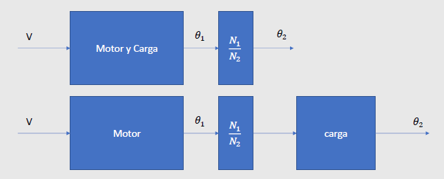

Felipe Cruz Pineda, Angie Vargas- M6A
# MODELAMIENTO DE SISTEMAS CON DIAGRAMAS:
En este apartado se explicara las bases del modelado de sistemas con diagramas y se presentaran ejemplos de como se puede implementar. 

## 1. Modelos de sistemas complejos:
>🔑 *Sistemas complejos:*
>- Se podrian modelar sistemas como un todo hallando las funciones de transferencia de cada componente.
>- Otro enfoque es utilizar modelos ya desarrollados ampliamente para construit modelos mas complejos.
>- Aun usando este enfoque hay muchos tipos de procesos y dispositivos.

a continuacion se podran mostrar algunos de los modelos de sistemas complejos que se pueden realizar:

### 1.1. Solenoide:
>🔑 *Solenoide:* Un solenoide esta formado por un circuito electrico, un acoplamiento electromecanico (transductor) y un sistema mecanico de trandlacion.

a continuacion veremos una imagen representativa de como de pueden ver estos tipos de sistemas y cual es su representacion o modelo en representacion de ecuaciones.

    

$$
L\frac{di}{dt}+Ri = v(t)
$$

$$
I(s) = V(s)\frac{1}{L_s + R}
$$

Estas son las ecuaciones que me representan el modelo del circuito electromecanico de la imagen anterior 

>🔑 El electroiman produce una fuerza mecanica proporcional a la corriente en el embobinado

a continuacion veremos el acople entre la parte electromecanica y la parte mecanica del modelo anteriormente presentado:

$$
f_s = k_s i
$$

$$
F_s(s) = K_s I(s)
$$

>🔑 El electroiman atrae una masa acoplada por medio de un resorte y de considera el amortiguamiento dado por la envolvente dela bobina.

A continuacion se mostraran las ecuaciones que me representan el sistema mecanico de la aterior imagen:

$$
m\frac{d^2x}{dt^2}+ b\frac{dx}{dt} + kx = f(t)
$$

$$
X(s) = F(s)\frac{1}{ms^2+bs+k}
$$

ya cuando tenemos este analisis procedemos a realizar la solucion par dejarlo en terminos de laplce (funcion de transferencia) y nos queda lo siguiente:

* Relación eléctrica con la mecánica, donde tenemos que:

$$
f _{(s)} = k _{s} * i
$$

* Funcion de transferencia
  
$$
\frac{F _{(s)} }{I _{(s)}} = K _{s}
$$

al terminar este sistemas procedemos a realizar una representacion en bloques dodnde trendremos los siguientes resultados.

    

    

### 1.2. Motor DC 
Lo siguiete que veremos es como se puede solucionar un sistema de un motor dc aplicando tosod los pasos y las formulas de modelamiento de un sistema que hemos estado viendo anteriormente.

    

Esta es la imagen que estaremos analizando de un motor DC

* Realizaremos primero el analisis para el circuito electromecanico que conforma el motor obteniendo como resultado las siguientres escuaciones (esto con el fin de hallar la corriente en el campo)
  
$$
L_c \frac{di_c}{dt}+R_ci_c = v_c(t)
$$

$$
I_c(s) = V_c(s)\frac{1}{(sL_c +R_c)}
$$

* EL flujo $\Phi$ el entrehierro es proporciona a la corriente dle campo dando la siguiente formula:
  
$$
\Phi = K_ci_c
$$

* Continuando con el modelo procedemos con el torque, el torque es desarrollado proporcional al $\Phi$ y a la corriente de armadura por lo que nos da lo siguiente:

$$
T_m = K_ai_a(t)K_ci_c(t)
$$

$$
T_m(s) = (K_aK_cI_a)I_c(s) = K_mI_c(s)
$$

* Luego el torque aplicado a la carga ed el desarrollado por el motor menos la inercia de la carga. dando como resultado lo siguiete:

$$
T_c(s) = T_m(s) - T_p(s)
$$

*Continuando con la parte mecanica, el torque aplicado a la carga se comporta como un sistema rotacional clasico que considera la inercia y la friccion mecanica. Por lo que nos da lo siguiente:

$$
J\frac{d^2\theta}{dt^2}+b\frac{d\theta}{dt}+k\theta = \tau(t)
$$

$$
\varTheta (s) = T_c(s)\frac{1}{s^2J+bs}
$$

* Procedemos a realizar la conexion de los modelos que obtuvimos anteriormente quedando de la siguiente manera: 

$$
\varTheta(s) = V_c(s)\frac{K_m}{(sL_c+R_c)(Js^2+bs)}- T_p(s)\frac{1}{Js^2+bs}
$$

$$
\frac{\varTheta(s)}{V_c(s)} = \frac{K_m}{(sL_c + R_c)(Js^2 + bs)}
$$

por lo que colocandolos en un diagrama de bloques queda de la siguiente manera:

    

* Para esta ocacion hallaremos las ecuaciones pero para la corriente de armadura
tenemos que la corriente de campo se asume constante por lo tanto el torque es:

$$
Tm(s) = (K_aK_cI_c)I_a(s) = K_mI_a(s)
$$

* Tambien tenemos que la corriente de armadura se relaciona con el voltaje aplicando a la armadura de la siguiente manera:

$$
V_a(s) = (sL_a+R_a)I_a(s) + V_b(s)
$$

* El voltaje inducido en la armadura es proporcional a la velocidad angular del eje:

$$
V_a(s) = (sL_a+R_a)I_a(s) + V_b(s)
$$

$$
V_b(s) = K_b\omega(s)
$$

* Ahora combinando las ecuaciones se obtiene lo siguiente:
  
$$
I_a(s) = \frac{V_a(s)-K_b\omega(s)}{sL_a+R_a}
$$

Por ultimo tenemos como se comporta la parte mecanica que el caso anterior  

$$
T_c(s) = T_m(s) - T_p(s)
$$

$$
\varTheta (s) = T_c(s)\frac{1}{s^2J +bs}
$$

Por ultim para representar este modelo de sistema tenemos el diagrama de bloques 

    

## 2. Elementos transmisores de energia 

### 2.1. Engranajes y poleas

>🔑 son dispositivos mecanicos que transmiten la energia desde una parte del sistema a otra
 

    

Por el momento tenemos las siguienters ecuaciones para poder entender el sistema 

$$
\frac{\tau_2}{\tau_1} = \frac{N_2}{N_1}
$$

$$
\frac{N_2}{N_1} = -\frac{\theta_1}{\theta_2}
$$

* J y K_{m} Van a coambiar si se tiene en cuenta el efecto de los engranajes o poleas teniendo las siguientes ecuaciones:
  
$$
\varTheta(s) = V_c(s)\frac{K_m}{(sL_c+R_c)(Js^2+bs)}-T_p(s)\frac{1}{(Js^2+bs)}
$$

$$
\frac{\varTheta(s)}{V_c(s)} = \frac{K_m}{(sL_c + R_c)(Js^2 + bs)}
$$

$$
\beta_{equiv} = \left(\frac{N_1}{N_2}\right)^2\beta
$$

$$
J_{equiv} = \left(J_{N1}+ \left(\frac{N_1}{N_2}^2\right)\left(J+J_{N2}\right)\right)
$$

Por ultimo tenemos el diagrama de bloques que representa el sistema 

    

y tenemos el sistema de transmision rotacional por medio de un diagrama de bloques 

    

    

### 2.2. Palancas:

    

En este caso tenemos nla representacio grafica de un sistema de palancas para la realizacion de un modelo, Luego de esto tenemos las siguientes ecuaciones que rigen el sistema:

$$
-\frac{f_2}{f_1} = \frac{d_1}{d_2}$ y $\frac{d_1}{d_2} = -\frac{x_1}{x_2}
$$

### 2.3. Potenciometros:
En este caso tenemos dos tipos de potenciometros donde tienen distintos comporamientos como los siguientes.

### 2.3.1. Potenciometro de rotacion

    

donde obtenemos las siguientes ecuaciones y su comportamiento en forma de grafica:

$$
V_o= \frac{\theta}{\theta_{max}}V_{cc}
$$

    

### 2.3.2. Potenciometro de traslacion:

    

donde obtenemos las siguientes ecuaciones que representan el sistema:

$$
V_o= \frac{x}{x_{max}}V_{cc}
$$

### 2.4. Tacómetros
En este caso hablaremos de  que es un tacometro y cual es su representacion y modelo 

>🔑 Son dispositivos que convierten la velocidad angular a voltaje.

    

$

aqui podemos observar la imagen de como esta compuesto el tacometro y una representacion en modo bloques.
Acontinuacion presentaremos las ecuaciones que rigen el sistema:

$$
v(t) = k\frac{d\theta(t)}{dt}
$$

$$
G(s) = \frac{V(s)}{\varTheta(s)} = ks
$$

## 3. Sensores transmisores 

    

Estos sensores pueden presentar distintos tipos por lo que cada uno de estos sensores tienen sus propias ecuaciones:

### 3.1. Lineales:
Si los sensores resultan ser lineales se representan de la siguiente manera:

$$
H(s) = \frac{TO}{PV} = k
$$

## 3.2. No lineales 

$$
H(s) = \frac{TO(S)}{PV(s)} = \frac{K_{T}}{T_{S}S+1}
$$

## 4. Modelos de otros procesos

### 4.1. Mezcla de sustancias 
Esto funciona de manera que  al tanque ingresa  cierta sustancia a con una cierta concentración en el tanque que tiene otra sustancia b por lo que se van a mezclar y la salida sera una sustancia en este caso c que sera la salida del sistema. 

    

La ecuacion que representa este tipo de sistemas es la siguiente:

$$
G(s) = \frac{Q(s)}{Q_i(s)} = \frac{\rho inicial^s + \rho in^vin}{s+v_{out}}
$$

💡**Ejemplo 1:**
* Sea un tanque lleno con ocho litros de agua salada en el cual estan disueltos dos kg de sal. Una solucion de salmuera (agua salada) con tres kg de sal por litro entra al tanque a una velocidad de 4 l/min, mientras la mezcla bien agitada sale a la misma velocidad con la que entra.

Solucionando el problema y modelando el sistema tenemos que su funcion de transferencia es:

$$
G(s) = \frac{Q(s)}{Q_i(s)} = \frac{2s+3\cdot4}{s+4}
$$

### 4.2. Sistemas Termicos
En este caso modelar estos sistemas es demaciado complejo por lo que se busca que con el conocimiento que ya tenemos podramos modelarlo de manera que las ecuaciones que de el sistema queden de primer orden como se mostrara mas adelante despues de la imagen 

    

 la ecuacion que corresponde al sistema es la siguiente:
 
 $$
 G(s) = \frac{T(s)}{Q_in(s)} = \frac{\frac{1}{C}}{s+\frac{1}{RC}}
 $$
 
 💡**Ejemplo 2:**
 

    

En este caso  se procede a hacer la solucion por modelamiento de diagrama de bloques por lo que queda lo siguiente  

    

## 5. Ejercicios externos: 

### 📚Ejercicio 1:

### 📚Ejercicio 2:

## 6. Conclusiones

## 7. Referencias
(https://acrobat.adobe.com/id/urn:aaid:sc:US:77379dba-797d-43ee-96b6-6cad6c837216)
https://www.canva.com/design/DAGWSRhEhjU/4UJ2cu8t_VBxrxqtgmSBPA/edit
https://dademuchconnection.wordpress.com/wp-content/uploads/2017/07/dinamica_de_sistemas.p
