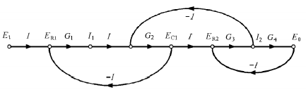

Felipe Cruz Pineda, Angie Vargas- M6A
# DIAGRAMA DE FLUJO DE SEÑALES 
En este apartado se procederá a explicar que son los diagramas de flujo de señales y como se pueden aplicar a los sistemas para poder analizarlos y entenderlos mejor

>🔑 * Diagramas de flujo de señales:*
>- Este tipo de diagramas permite otra forma de representacion de los sistemas mas complejos
>- Se utilizan para obtener de una manera mas sencilla la funcion de transferencia total del sistema
>- La formula de Mason permite calcular la funcion de transferencia de sistemas muy complejos

Basicamente lo que quiere decir que el flujo de señales es la relacion que hay entre las entradas y salidas del sistema. Tambien se puede referir a que este diagrama es el proceso sistematico del sistema en cuestion.

## 1. Elementos de los diagrams de flujo de señal

>🔑 *Nodo:* Esto represenga las señales de entrada o salida del sistema
>- Se representa por medio de un circulo con una etiqueta que indique el nombre de la señal.

Esto anteriormente explicado se representa de la siguiente manera:

    

Dentro de estos diagramas las figuras representativas ( en este caso los circulos) pueden dejarse vacios o en su defecto rellenarse.

>🔑 *Flechas:* Representa la relacion entre las variables del sistema
>- Se representa por medio d eflechas que indican el sentido de la relacion
>- La flecha sale de la señas (del nodo) de entrada y llega a la señal de la salida (nodo)
>- Se agrega uns etiqueta a la flecha para indicar la funcion de transferencia que relaciona la entrada y la salida.

En pocas palabras las flechas son la relacion entre dos señales que me pueden representar una funcion de transferencia y se representa de la siguiente manera:

    

## 2. Interpretacion  de los diagramas de flujo

A continuacion procedemos a mostrar como se puede interpretar las señales de los diagramas de flujo por medio de una tabla:

    

## 2. Definiciones
>🔑 *Camino o trayectoria:* El camino o trayectoria es un recorrido de ramas conectadas en el sentido de las flechas de las ramas.
>- Si no se cruza ningun nodo mas de una vez, el camino o trayecto es abierto
>- Si el camino o trayecto finaliza en el mismo nodo del caul partio y no cruza ningun otro mas de una vez es un camino o trayecto cerrado.

>[!NOTE]
>nunca se puede repetir un nodo, Solo se inicia y se realimenta pero no se repite nodo

>🔑 *Ganancia de lazo:* La ganancia de lazo es el producto de las ganancias de ramas de un lazo

>🔑 *Trayecto o camino directo:* Trayecto directo es el camino o trayecto de un nodo de entrada a un nodo de salida, sin cruzar ningun nodo mas  de una vez.

>🔑 *Ganancia de trayecto directo:* La ganacia de trayecto directo es el producto de  las ganancias de rama de un camino o trayecto directo.

>🔑 *Lazo:* Un lazo es un camino o trayecto cerrado
 
En este caso procederemos a ver la representacion grafica de los diagramas teniendo en cuenta lo anterior:

    

## 3. Formula de Mason

$$
P = \frac{1}{\Delta}\sum\limits_k P_k \Delta_k
$$

$$
P_k \longrightarrow Ganancia de los caminos directos
$$

$$
\Delta = 1 - $ (suma ganancias de los lazos) + (suma producto de $2$
lazos que no se tocan) $–$ (suma producto de $3$ lazos que no se
tocan)$+…$)
$$

$$
\Delta_k = 1 - $(suma ganancias lazos que no toquen la trayectoria
$P_k$) $+$ (suma ganancias $2$ lazos que no toquen la trayectoria $P_k$ y
no se toquen entre sí)$-$(suma ganancias $3$ lazos que no toquen
la trayectoria $P_k$ y no se toquen entre sí)$+…$
$$

💡**Ejemplo 1:** 

    

#### Trayectoria directos

$$
P_1 = 1\cdot1\cdot G_1\cdot G_2 \cdot G_3 \cdot 1 = G_1G_2G_3
$$

#### Lazos Cerrados

$$
L_1 = G_1G_2H_1
$$

$$
L_2 = -G_2G_3H_2
$$

$$
L_3 = -G_1G_2G_3
$$

$$
\Delta = 1 - (L_1+L_2+L_3) \longrightarrow Determinante
$$

$$
\Delta_1 = 1 \longrightarrow Cofactores
$$

$$
\frac{C_{(s)}}{R_{(s)}} = \frac{P_1\Delta_1}{\Delta} = \frac{G_1G_2G_3}{1-G_1G_2H_1+G_2G_3H_2+G_1G_2G_3}
$$

💡**Ejemplo 2:**

    

#### Ganancia de Trayectoria directa

$$
P_1 = G_1G_2G_3G_4G_5
$$

$$
P_2 = G_1G_6G_4G_5
$$

$$
P_3 = G_1G_2G_7
$$

#### Ganancia de Lazo

$$
L_1 = -G_4H_1
$$

$$
L_2 = -G_2G_7H_2
$$

$$
L_3 = -G_6G_4G_5H_2
$$

$$
L_4 = -G_2G_3G_4G_5H_2
$$

#### Determinante

$$
\Delta = 1 - (L_1+L_2+L_3+L_4)+L_1L_2
$$

#### Cofactores

$$
\Delta_1 = 1
$$

$$
\Delta_2 = 1
$$

$$
\Delta_3 = 1 - L_1
$$

$$
L_1$ no toca trayectoria
$$

$$
\frac{C_{(s)}}{R_{(s)}} = \frac{1}{\Delta}(P_1\Delta_1 + P_2\Delta_2 + P_3\Delta_3) = \frac{G_1G_2G_3G_2G_5+G_1G_6G_4G_5+G_1G_2G_3(1+G_4H_1)}{1+G_4H1+G_2G_7H_2+G_6G_4G_5H_2+G_2G_3G_4G_5H_2+G_4H_1G_2G_7H_2}
$$

💡**Ejemplo 3:**

    

### Trayectoria directa

$$
P_1 = 1 G_1 1 G_2 1 G_3G_4G_5
$$

$$
P_1 =  G_1G_2G_3G_4
$$

#### Lazo cerrado

$$
L_1 = -G_1G_2
$$

$$
L_2 = -G_3G_4
$$

$$
L_3 = -G_2G_3
$$

#### Determinante

$$
\Delta = 1 - (L_1+L_2+L_3)+L_1L_2
$$

#### Cofactores

$$
\Delta_1 = 1
$$

$$
\frac{E_{0}}{E_{1}} = \frac{G_1 G_2 G_3 G_4}{1 + G_1 G_2 G_3 G_4 + G_2 G_3 + G_1 G_2 G_3 G_4}
$$

## 4. Ejercicios externos: 

### 📚Ejercicio 1:

### 📚Ejercicio 2:

## 5. Conclusiones

## 6. Referencias
https://acrobat.adobe.com/id/urn:aaid:sc:US:71394447-b9cc-4ebe-8898-e8731e65012f
https://www.canva.com/design/DAGWSRhEhjU/4UJ2cu8t_VBxrxqtgmSBPA/edit
https://dademuchconnection.wordpress.com/wp-content/uploads/2017/07/dinamica_de_sistemas.pdf
